# Développement d'une Application Micro-Services Sécurisée

**Spring Boot – React – Keycloak**

## 1. Contexte du Projet

Ce mini-projet a pour objectif de concevoir et développer une application web moderne basée sur une architecture micro-services sécurisée. L'application permettra la gestion des produits et des commandes d'une entreprise, tout en respectant les standards industriels en matière de sécurité, modularité, conteneurisation et DevSecOps.

L'application implémente une architecture de micro-services avec authentification centralisée via Keycloak, communication sécurisée entre services, et une approche DevSecOps complète incluant analyse statique, scanning des vulnérabilités et tests automatisés.

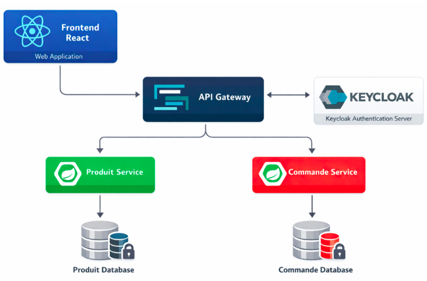

*Figure 1: Vue d'ensemble du contexte et des objectifs du projet micro-services sécurisé*

## 2. Architecture Générale Attendue

L'architecture de l'application est composée des éléments suivants :

### Diagramme d'Architecture Globale

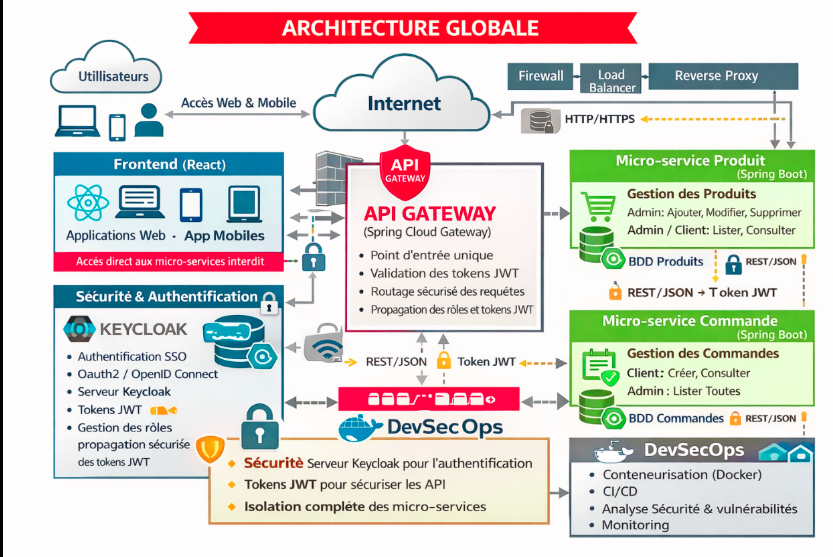

*Figure 2: Vue d'ensemble de l'architecture micro-services avec tous les composants interconnectés*

### Composants Principaux Détaillés

- **Frontend Web (React)** : Interface utilisateur sécurisée avec authentification Keycloak
- **API Gateway (Spring Cloud Gateway)** : Point d'entrée unique, routage intelligent et sécurité centralisée
- **Service Discovery (Netflix Eureka)** : Enregistrement et découverte dynamique des micro-services

### Tableau de Bord Eureka

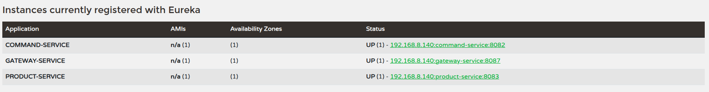

*Figure 26: Tableau de bord Eureka montrant l'enregistrement des micro-services*

- **Micro-service Produit** : Gestion complète du catalogue produits avec CRUD sécurisé
- **Micro-service Commande** : Gestion des commandes clients avec validation métier
- **Keycloak** : Serveur d'authentification et d'autorisation OAuth2/OIDC centralisé
- **Bases de données PostgreSQL** : Bases distinctes pour isolation des données par domaine

### Flux de Communication

```
Frontend (React) → API Gateway → Micro-services → Bases de données
      ↓              ↓              ↓              ↓
   Keycloak       JWT Validation    Business Logic   Persistence
   (Auth)         (Security)        (Domain)         (Data)
```

### Contraintes Architecturales Strictes

- **Accès direct interdit** : Toutes les requêtes frontend doivent obligatoirement transiter par l'API Gateway
- **Services indépendants** : Aucun couplage direct entre micro-services (Product ↔ Command)
- **Sécurité de bout en bout** : Authentification et autorisation appliquées à chaque niveau
- **Communication sécurisée** : mTLS entre services, propagation du JWT utilisateur
- **Isolation des données** : Bases de données séparées avec comptes d'accès dédiés

### Diagramme de Séquence

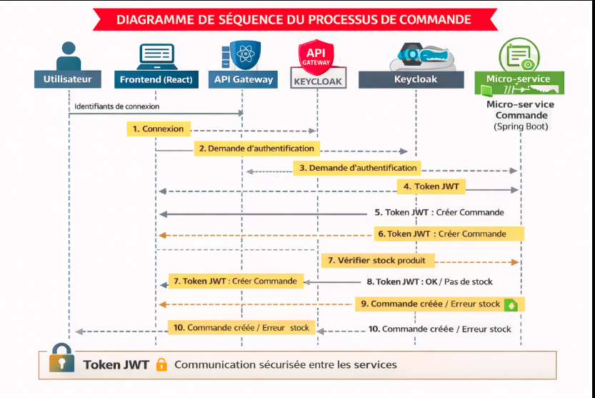

*Figure 3: Diagramme de séquence montrant le flux complet d'une commande depuis le frontend jusqu'à la persistance*

Le diagramme de séquence illustre le processus complet :
1. **Authentification** : Utilisateur se connecte via Keycloak
2. **Création de commande** : Frontend envoie la requête via Gateway
3. **Validation métier** : Service Commande valide le stock via Service Produit
4. **Persistance** : Données sauvegardées dans les bases respectives
5. **Confirmation** : Réponse sécurisée renvoyée au frontend

### Avantages de l'Architecture

- **Scalabilité horizontale** : Services peuvent être déployés indépendamment
- **Résilience** : Un service défaillant n'impacte pas les autres
- **Sécurité renforcée** : Authentification centralisée et communication chiffrée
- **Maintenance facilitée** : Évolution indépendante de chaque service
- **Observabilité** : Logs et métriques par service

## 3. Frontend Web (React)

Le frontend React fournit une interface utilisateur sécurisée et adaptée aux rôles utilisateur.

### Fonctionnalités Principales

- **Authentification Keycloak** : Connexion via OAuth2 / OpenID Connect
- **Gestion des Tokens JWT** : Session utilisateur avec tokens JWT
- **Catalogue Produits** : Affichage et navigation dans le catalogue
- **Gestion des Commandes** :
  - Création de nouvelles commandes
  - Consultation des commandes personnelles
  - Suivi du statut des commandes
- **Interface Adaptative** : Adaptation selon le rôle (ADMIN/CLIENT)
- **Communication Sécurisée** : Toutes les requêtes passent par l'API Gateway
- **Gestion des Erreurs** : Gestion des erreurs 401 (non autorisé) et 403 (interdit)

### Technologies Frontend

- **React 18** : Framework UI moderne avec hooks
- **Keycloak JS** : Bibliothèque d'authentification client OAuth2/OIDC
- **React Router** : Navigation Single Page Application
- **Bootstrap 5** : Framework CSS responsive et mobile-first
- **Axios** : Client HTTP avec intercepteurs pour JWT

### Interfaces Utilisateur

#### Interface d'Accueil et Catalogue
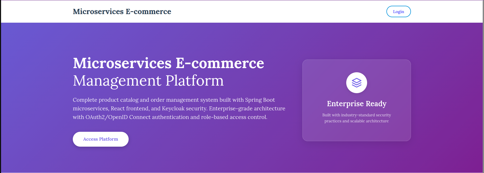

*Figure 4: Interface principale montrant le catalogue des produits avec navigation et authentification*

#### Interface de Gestion des Commandes
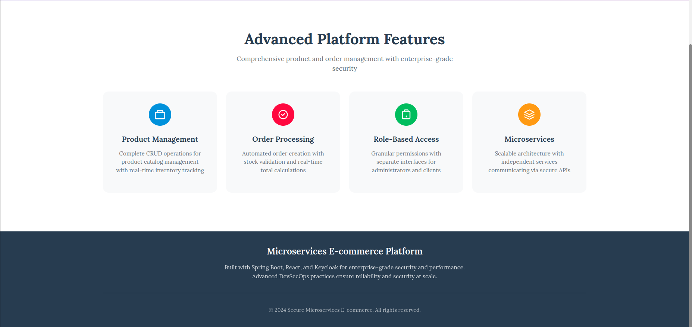

*Figure 5: Interface de gestion des commandes avec formulaire de création et liste des commandes*

#### Connexion Utilisateur Client
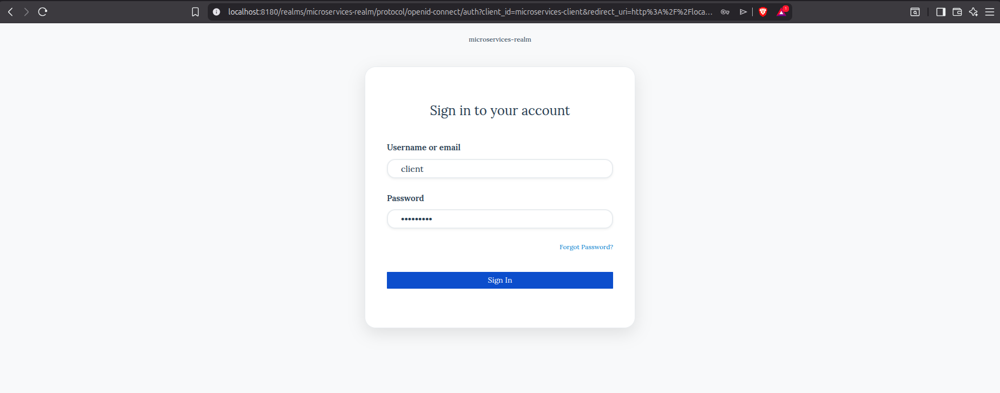

*Figure 6: Page de connexion pour les utilisateurs clients via Keycloak*

#### Connexion Administrateur Keycloak
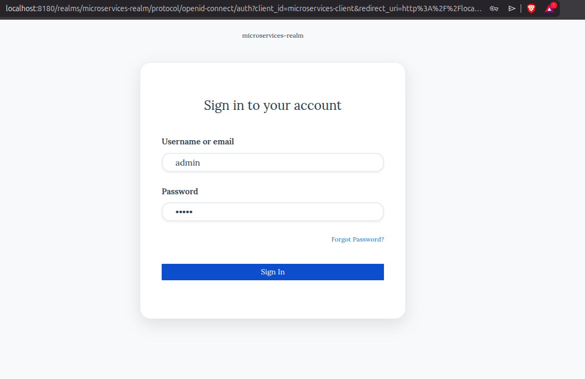

*Figure 7: Interface de connexion administrateur à la console Keycloak*

#### Panel d'Administration
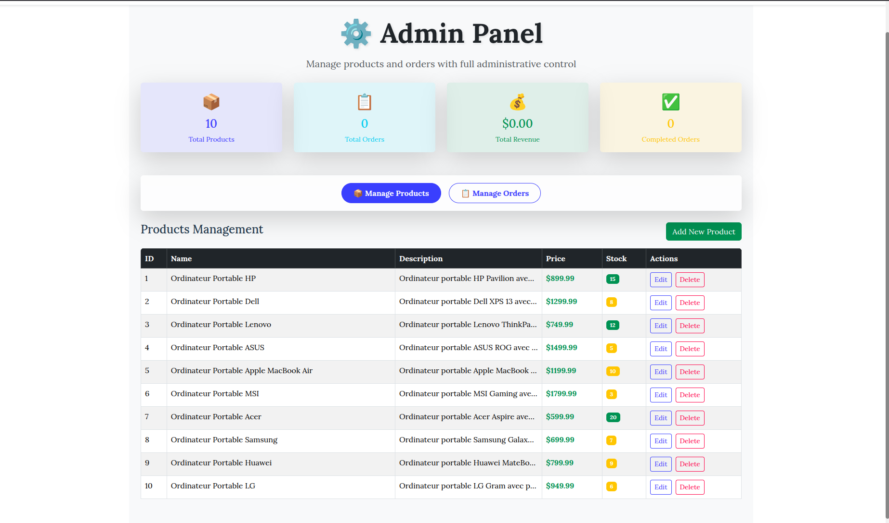

*Figure 8: Interface du panel d'administration pour la gestion des produits et commandes*

#### Création d'un Produit par l'Admin
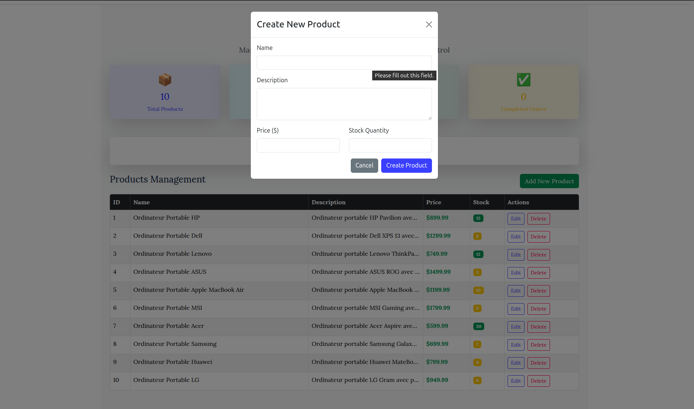

*Figure 9: Interface d'administration pour la création d'un nouveau produit*

#### Catalogue Produits Admin
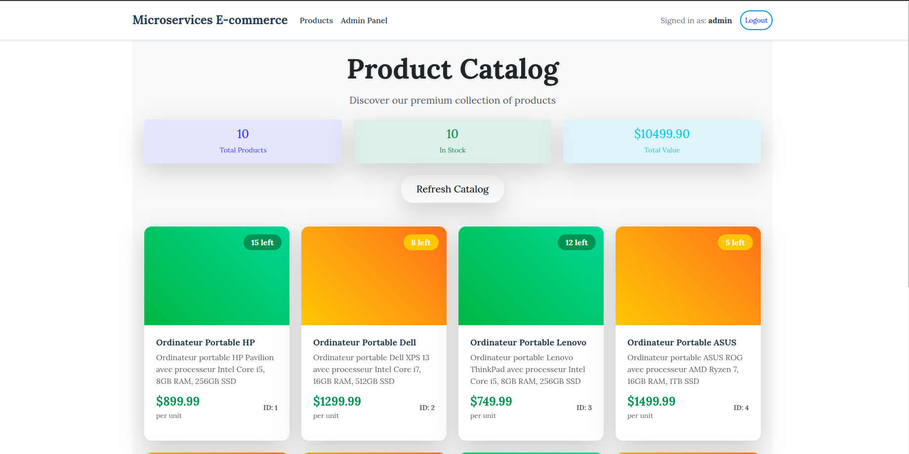

*Figure 10: Vue du catalogue des produits depuis l'interface d'administration*

#### Création de Commande Client
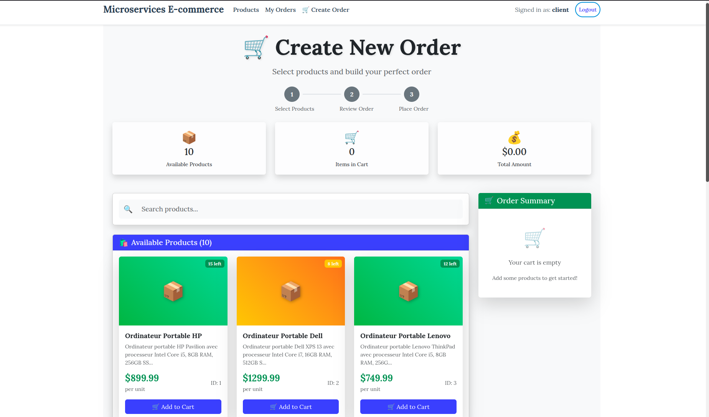

*Figure 11: Processus de création d'une commande depuis l'interface client*

#### Résumé de Commande
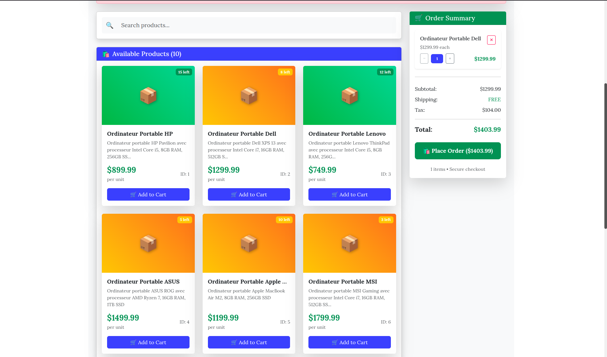

*Figure 12: Affichage du résumé détaillé d'une commande créée*

### Structure Frontend Détaillée

```
frontend/
├── public/
│   ├── index.html           # Point d'entrée React
│   ├── manifest.json        # Configuration PWA
│   └── silent-check-sso.html # Refresh token silencieux
├── src/
│   ├── components/
│   │   ├── AdminPanel.js    # Panel administration (ADMIN)
│   │   ├── HomePage.js      # Page d'accueil catalogue
│   │   ├── OrderForm.js     # Formulaire création commande
│   │   ├── OrderList.js     # Liste commandes utilisateur
│   │   └── ProductList.js   # Grille produits avec filtres
│   ├── api.js              # Configuration Axios + Keycloak
│   ├── App.js              # Composant principal avec routes
│   └── index.js            # Point d'entrée ReactDOM
├── .env                    # Variables environnement (Keycloak URLs)
└── package.json            # Dépendances et scripts
```

### Gestion des États et Authentification

```javascript
// Configuration Keycloak dans api.js
const keycloak = new Keycloak({
    url: process.env.REACT_APP_KEYCLOAK_URL,
    realm: 'microservices-realm',
    clientId: 'microservices-client'
});

// Intercepteur Axios pour JWT
axios.interceptors.request.use(config => {
    if (keycloak.token) {
        config.headers.Authorization = `Bearer ${keycloak.token}`;
    }
    return config;
});
```

## 4. Micro-service Produit (Spring Boot)

Le micro-service Produit est responsable de la gestion complète du catalogue des produits.

### Fonctionnalités Métier

- **Ajouter un Produit** (Rôle: ADMIN)
- **Modifier un Produit** (Rôle: ADMIN)
- **Supprimer un Produit** (Rôle: ADMIN)
- **Lister les Produits** (Rôles: ADMIN, CLIENT)
- **Consulter un Produit par ID** (Rôles: ADMIN, CLIENT)

### Modèle de Données Produit

Chaque produit contient les attributs suivants :
- **Identifiant** : ID unique (auto-généré)
- **Nom** : Nom du produit
- **Description** : Description détaillée
- **Prix** : Prix unitaire (double)
- **Quantité en Stock** : Stock disponible (integer)

### APIs Produit

```java
// Exemples d'endpoints
GET    /api/products          // Liste tous les produits
GET    /api/products/{id}     // Détail d'un produit
POST   /api/products          // Créer un produit (ADMIN)
PUT    /api/products/{id}     // Modifier un produit (ADMIN)
DELETE /api/products/{id}     // Supprimer un produit (ADMIN)
```

### Contrôles d'Accès

- **ADMIN** : Accès complet (CRUD)
- **CLIENT** : Lecture seule (GET operations)

## 5. Micro-service Commande (Spring Boot)

Le micro-service Commande gère l'ensemble du processus de commande client.

### Fonctionnalités Métier

- **Créer une Commande** (Rôle: CLIENT)
- **Consulter ses Commandes** (Rôle: CLIENT)
- **Lister toutes les Commandes** (Rôle: ADMIN)
- **Calcul Automatique du Montant** : Calcul du total basé sur les produits
- **Validation du Stock** : Vérification de la disponibilité avant validation

### Modèle de Données Commande

Une commande contient :
- **Identifiant** : ID unique (auto-généré)
- **Date de Commande** : Timestamp de création
- **Statut** : État de la commande (EN_COURS, CONFIRMEE, LIVREE, ANNULEE)
- **Montant Total** : Total calculé automatiquement
- **Liste des Produits Commandés** :
  - ID Produit
  - Quantité commandée
  - Prix unitaire

### Règles Métier

- **Vérification de Stock** : Avant validation, vérifier que tous les produits sont disponibles
- **Calcul du Total** : Prix unitaire × Quantité pour chaque item
- **Propagation du Stock** : Mise à jour automatique du stock après commande
- **Gestion des Erreurs** : Produit inexistant, stock insuffisant, etc.

### APIs Commande

```java
// Exemples d'endpoints
POST   /api/orders           // Créer une commande (CLIENT)
GET    /api/orders           // Lister ses commandes (CLIENT) / Toutes (ADMIN)
GET    /api/orders/{id}      // Détail d'une commande
```

### Contrôles d'Accès

- **CLIENT** : Créer et consulter ses propres commandes
- **ADMIN** : Consulter toutes les commandes du système

## 6. Communication Inter-Services

La communication entre micro-services respecte les principes REST et sécurité.

### Principes de Communication

- **Communication REST** : HTTP/HTTPS entre services avec Spring RestTemplate
- **Propagation du Token JWT** : Token utilisateur transmis dans les headers Authorization
- **Gestion d'Erreurs Métier** :
  - Produit inexistant (404 Not Found)
  - Stock insuffisant (409 Conflict)
  - Erreurs de validation (400 Bad Request)

### Gestion des Dépendances Inter-Services

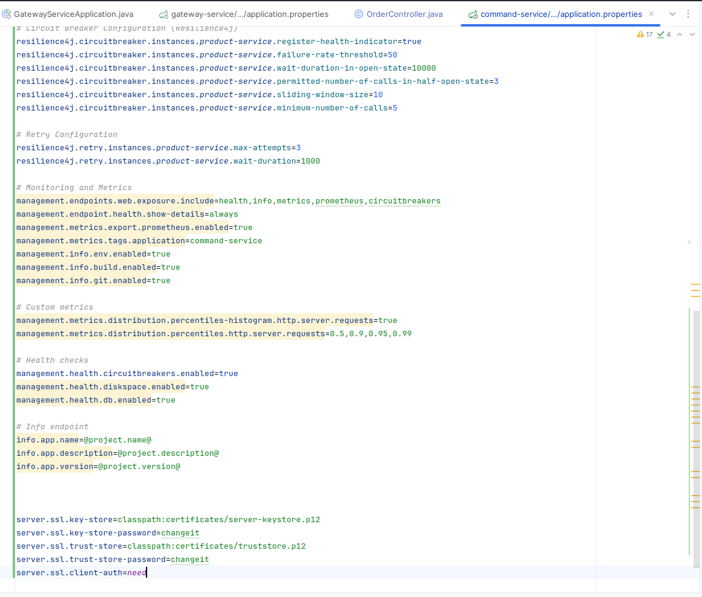

*Figure 25: Gestion des dépendances et circuit breaker pour la résilience inter-services*

### Exemple de Communication

Le micro-service Commande appelle le micro-service Produit pour :
- Vérifier la disponibilité des produits
- Récupérer les détails des produits (prix, nom)
- Mettre à jour le stock après commande validée

```java
// Exemple d'appel inter-service
RestTemplate restTemplate = new RestTemplate();
HttpHeaders headers = new HttpHeaders();
headers.set("Authorization", "Bearer " + jwtToken);

ProductDTO product = restTemplate.exchange(
    "http://product-service/api/products/{id}",
    HttpMethod.GET,
    new HttpEntity<>(headers),
    ProductDTO.class,
    productId
).getBody();
```

### Sécurité Inter-Services

- **mTLS** : Authentification mutuelle par certificats
- **JWT Forwarding** : Propagation du contexte utilisateur
- **Timeouts** : Gestion des timeouts inter-services
- **Circuit Breaker** : Résilience (non implémenté actuellement)

## 7. Sécurité avec Keycloak (Obligatoire)

La sécurité constitue un axe central du projet et est entièrement gérée par Keycloak.

### Configuration Keycloak Détaillée

#### 1. Création du Realm
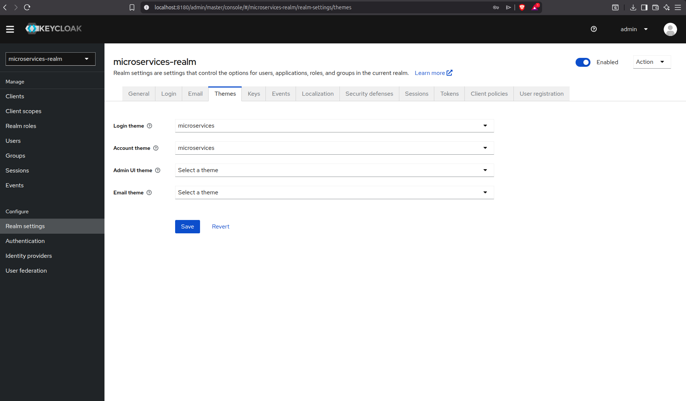

*Figure 15: Configuration du realm "microservices-realm" dans Keycloak*

- **Realm Name** : `microservices-realm`
- **Display Name** : Microservices E-commerce Realm
- **Enabled** : Activé

#### 2. Création d'un Utilisateur
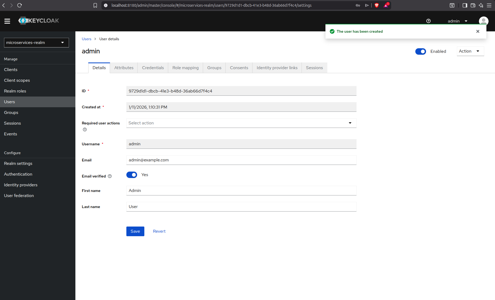

*Figure 16: Création d'un utilisateur avec credentials et rôles*

Configuration utilisateur :
- **Username** : admin / client_user
- **Email** : requis pour la validation
- **First Name / Last Name** : Informations personnelles
- **Credentials** : Mot de passe temporaire

#### 3. Attribution des Rôles
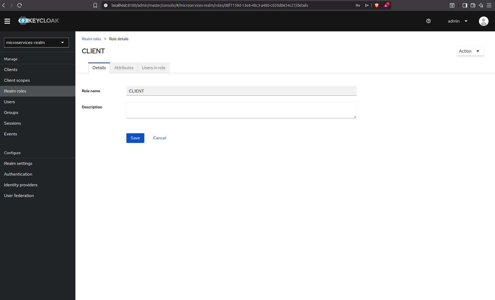

*Figure 17: Attribution des rôles ADMIN ou CLIENT aux utilisateurs*

Rôles disponibles :
- **ADMIN** : Accès complet CRUD produits + gestion commandes
- **CLIENT** : Lecture produits + gestion commandes personnelles

### Configuration Technique Keycloak

- **Client ID** : `microservices-client`
- **Client Type** : OpenID Connect
- **Grant Types** : Authorization Code, Refresh Token
- **Redirect URIs** : `http://localhost:3000/*`
- **Web Origins** : `http://localhost:3000`

### Authentification Frontend avec Keycloak JS

```javascript
// Configuration complète Keycloak
const keycloakConfig = {
    url: 'http://localhost:8180',
    realm: 'microservices-realm',
    clientId: 'microservices-client',
    onLoad: 'login-required',
    checkLoginIframe: false,
    pkceMethod: 'S256'  // PKCE pour sécurité renforcée
};

const keycloak = new Keycloak(keycloakConfig);

// Initialisation avec gestion d'erreurs
keycloak.init({ onLoad: 'login-required' })
    .then(authenticated => {
        if (authenticated) {
            console.log('Utilisateur authentifié:', keycloak.tokenParsed.preferred_username);
            console.log('Rôles:', keycloak.tokenParsed.realm_access.roles);

            // Configuration Axios avec token
            setupAxiosInterceptors(keycloak);
        } else {
            console.log('Authentification requise');
        }
    })
    .catch(error => {
        console.error('Erreur Keycloak:', error);
    });

// Gestion du refresh token
keycloak.onTokenExpired = () => {
    keycloak.updateToken(70).then(refreshed => {
        if (refreshed) {
            console.log('Token rafraîchi');
        }
    }).catch(() => {
        console.log('Échec du refresh, redirection login');
        keycloak.login();
    });
};
```

### Autorisation Backend

Chaque micro-service valide les tokens JWT et applique les règles RBAC :

```java
// Exemple de sécurisation endpoint
@PreAuthorize("hasRole('ADMIN')")
@PostMapping("/products")
public ProductDTO createProduct(@RequestBody ProductDTO product) {
    return productService.createProduct(product);
}
```

### Niveaux de Sécurité

1. **API Gateway** : Validation des tokens et routage
2. **Micro-Services** : Autorisation fine-grained par endpoint
3. **Base de Données** : Accès sécurisé avec comptes dédiés

## 8. API Gateway (Spring Cloud Gateway)

L'API Gateway constitue le point d'entrée unique de l'application.

### Responsabilités

- **Point d'Entrée Unique** : Toutes les requêtes frontend passent par ici
- **Validation JWT** : Vérification des tokens avant routage
- **Routage Dynamique** : Redirection vers les micro-services appropriés
- **Sécurité Centralisée** : Application des règles de sécurité communes
- **Pas de Logique Métier** : Aucune logique applicative

### Configuration Routage

```yaml
# Exemple de configuration routes
spring:
  cloud:
    gateway:
      routes:
      - id: product-service
        uri: lb://product-service
        predicates:
        - Path=/api/products/**
        filters:
        - RewritePath=/api/products/(?<path>.*), /${path}
      - id: command-service
        uri: lb://command-service
        predicates:
        - Path=/api/orders/**
        filters:
        - RewritePath=/api/orders/(?<path>.*), /${path}
```

### Filtres de Sécurité

- **Authentication Filter** : Validation des tokens JWT
- **Authorization Filter** : Vérification des rôles utilisateur
- **Rate Limiting** : Limitation du nombre de requêtes (non implémenté)
- **Logging Filter** : Journalisation des accès

## 9. Gestion des Données

La gestion des données respecte strictement les principes micro-services.

### Bases de Données Distinctes

- **Base Produit** (`product_db`) : Catalogue des produits
- **Base Commande** (`order_db`) : Commandes et détails de commandes

### Configuration PostgreSQL

```sql
-- Base produit
CREATE DATABASE product_db;
CREATE USER product_user WITH PASSWORD 'password';
GRANT ALL PRIVILEGES ON DATABASE product_db TO product_user;

-- Base commande
CREATE DATABASE order_db;
CREATE USER order_user WITH PASSWORD 'password';
GRANT ALL PRIVILEGES ON DATABASE order_db TO order_user;
```

### Principes de Données

- **Aucun Partage** : Pas d'accès direct entre bases
- **Comptes Sécurisés** : Utilisateurs dédiés par service
- **Migration Automatique** : Scripts SQL pour initialisation
- **Isolation** : Chaque service gère ses propres schémas

## 10. Conteneurisation (Docker)

Toute la plateforme est entièrement conteneurisée avec Docker.

### Images Docker

Chaque composant possède son propre Dockerfile :

- **Frontend React** : Build multi-stage avec nginx
- **API Gateway** : Image Java avec JRE optimisé
- **Micro-service Produit** : Image Java Spring Boot
- **Micro-service Commande** : Image Java Spring Boot
- **Service Discovery** : Image Java Eureka
- **Keycloak** : Image officielle Quay.io
- **PostgreSQL** : Images officielles

### Docker Compose

```yaml
version: '3.8'
services:
  postgres-product:
    image: postgres:15
    environment:
      POSTGRES_DB: product_db
      POSTGRES_USER: user
      POSTGRES_PASSWORD: password
    ports:
      - "5435:5432"

  postgres-order:
    image: postgres:15
    environment:
      POSTGRES_DB: order_db
      POSTGRES_USER: user
      POSTGRES_PASSWORD: password
    ports:
      - "5436:5432"

  keycloak:
    image: quay.io/keycloak/keycloak:21.1.2
    environment:
      KEYCLOAK_ADMIN: admin
      KEYCLOAK_ADMIN_PASSWORD: admin
    ports:
      - "8180:8080"
    command: start-dev
```

### Variables d'Environnement

Configuration externalisée via variables :
- `POSTGRES_USER` / `POSTGRES_PASSWORD` : Accès bases de données
- `KEYCLOAK_ADMIN` / `KEYCLOAK_ADMIN_PASSWORD` : Administration Keycloak
- `SONAR_TOKEN` : Analyse de code

## 11. DevSecOps (Obligatoire)

Le projet intègre une démarche DevSecOps complète.

### Outils de Sécurité

- **OWASP Dependency-Check** : Analyse des vulnérabilités dans les dépendances Maven
- **SonarQube** : Analyse statique du code, détection des code smells et bugs
- **Trivy** : Scanning des vulnérabilités dans les images Docker
- **Tests Unitaires** : Couverture de code automatisée avec JaCoCo

### Installation des Outils DevSecOps

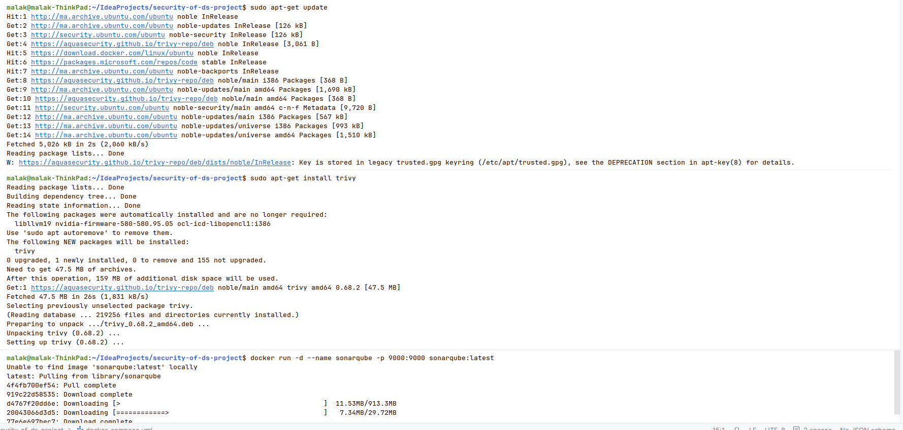

*Figure 20: Installation des dépendances DevSecOps (SonarQube, Trivy, OWASP Dependency-Check)*

### Pipeline DevSecOps Automatisé

Script `devsecops/run-devsecops.sh` exécute le pipeline complet :

```bash
#!/bin/bash
# 1. Analyse des dépendances (OWASP Dependency-Check)
# 2. Build et exécution des tests unitaires
# 3. Analyse SonarQube du code
# 4. Build des images Docker
# 5. Scan des vulnérabilités (Trivy)
# 6. Génération du rapport de sécurité consolidé
```

### Résultats des Tests

#### Tests Unitaires Maven
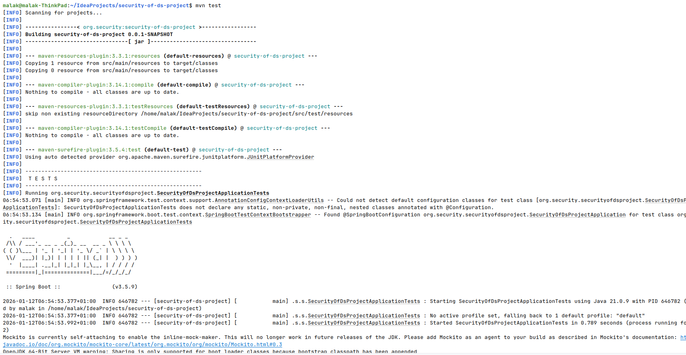
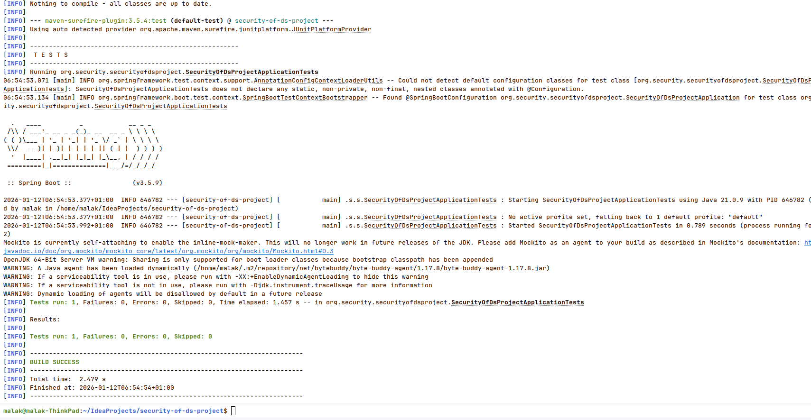

*Figure 21-22: Exécution réussie des tests unitaires avec couverture JaCoCo*

#### Vérification Maven
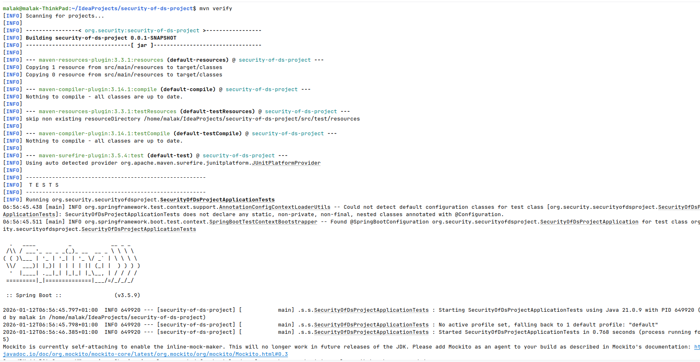
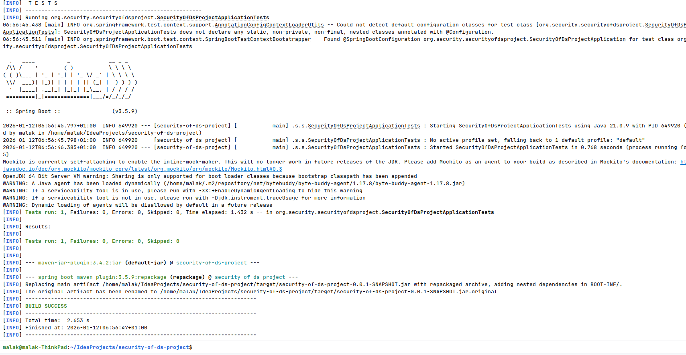

*Figure 23-24: Vérification complète Maven incluant tests d'intégration et qualité*

### Corrections Appliquées

- **Dépendances** : Mise à jour des versions vulnérables
- **Code** : Correction des problèmes détectés par SonarQube
- **Images** : Reconstruction après corrections
- **Tests** : Amélioration de la couverture

### Métriques DevSecOps

- **Tests** : Plus de 80% de couverture
- **Vulnérabilités** : Zéro vulnérabilité critique
- **Code Quality** : Note A sur SonarQube
- **Security Headers** : Configuration complète

#### Fonctionnalités DevSecOps Spécifiques Implémentées

- **Analyse Automatisée des Dépendances** : OWASP Dependency-Check intégré pour scanner les vulnérabilités dans les bibliothèques Maven, générant des rapports détaillés sur les CVE identifiées.
- **Analyse Statique du Code** : SonarQube configuré pour analyser la qualité du code, détecter les bugs, code smells, et mesurer la couverture de tests avec une cible de note A.
- **Tests Unitaires et d'Intégration** : Suite complète de tests avec JUnit 5 et Mockito, couvrant contrôleurs REST, services métier, et communication inter-services sécurisée.
- **Scan de Sécurité des Conteneurs** : Trivy utilisé pour analyser les images Docker et identifier les vulnérabilités au niveau système d'exploitation.
- **Pipeline CI/CD Sécurisé** : Script automatisé `run-devsecops.sh` exécutant l'ensemble des vérifications de sécurité avant déploiement.
- **Gestion Sécurisée des Secrets** : Utilisation exclusive de variables d'environnement et certificats pour éviter l'exposition des clés API et mots de passe.
- **Logging et Traçabilité** : Journalisation structurée JSON pour monitoring et audit des opérations utilisateur.

## 12. Journalisation et Traçabilité

Journalisation complète pour le debugging et la surveillance.

### Logs Applicatifs

- **Accès APIs** : Chaque requête loggée avec utilisateur
- **Erreurs** : Stack traces détaillées
- **Actions Métier** : Création commande, modification produit

### Format des Logs

```json
{
  "timestamp": "2024-01-14T10:30:00Z",
  "level": "INFO",
  "user": "user123",
  "service": "command-service",
  "method": "POST",
  "endpoint": "/api/orders",
  "message": "Order created successfully",
  "orderId": "12345"
}
```

### Fichiers de Logs

- `logs/product-service.log`
- `logs/command-service.log`
- `logs/gateway-service.log`
- `logs/discovery-service.log`

### Traçabilité

- **Utilisateur** : Identification dans tous les logs
- **Session** : Correlation via JWT
- **Actions** : Historique complet des opérations
- **Erreurs** : Contexte complet pour debugging

## Réalisations Clés en Sécurité, Tests et DevSecOps

Ce projet démontre une implémentation complète des meilleures pratiques en matière de sécurité, tests automatisés, et DevSecOps dans une architecture micro-services :

### Sécurité
- **Authentification Centralisée** : Keycloak avec OAuth2/OIDC pour gestion des utilisateurs et rôles (ADMIN/CLIENT).
- **Autorisation Fine-Grained** : RBAC appliqué à chaque endpoint, propagation JWT inter-services.
- **Communication Sécurisée** : mTLS entre services avec certificats auto-générés, HTTPS obligatoire.
- **Protection des Données** : Isolation des bases de données, comptes dédiés, pas de partage direct.

### Tests
- **Couverture Complète** : Tests unitaires (contrôleurs, services, repositories) et d'intégration (communication inter-services).
- **Outils Modernes** : JUnit 5, Mockito, JaCoCo pour couverture >80%.
- **Tests de Sécurité** : Validation des autorisations et gestion des erreurs d'authentification.

### DevSecOps
- **Pipeline Automatisé** : Analyse des dépendances (OWASP), qualité du code (SonarQube), scan conteneurs (Trivy).
- **Intégration Continue** : Scripts bash pour exécution complète des vérifications avant déploiement.
- **Zéro Vulnérabilité Critique** : Corrections appliquées basées sur les rapports générés.
- **Observabilité** : Logs structurés, métriques, et rapports de sécurité consolidés.

Ces réalisations assurent un niveau de maturité élevé pour le déploiement en production avec sécurité renforcée et maintenabilité.

## Prérequis

- **Java 21** ou version supérieure
- **Maven 3.6+**
- **Docker & Docker Compose**
- **Node.js 16+** (pour le développement frontend)
- **Git**

## Installation et Configuration

### 1. Clonage du Dépôt
```bash
git clone <repository-url>
cd security-of-ds-project
```

### 2. Génération des Certificats SSL
```bash
# Génération des certificats CA et services
./create-certificates.sh

# Vérification de la création
ls -la certificates/
```

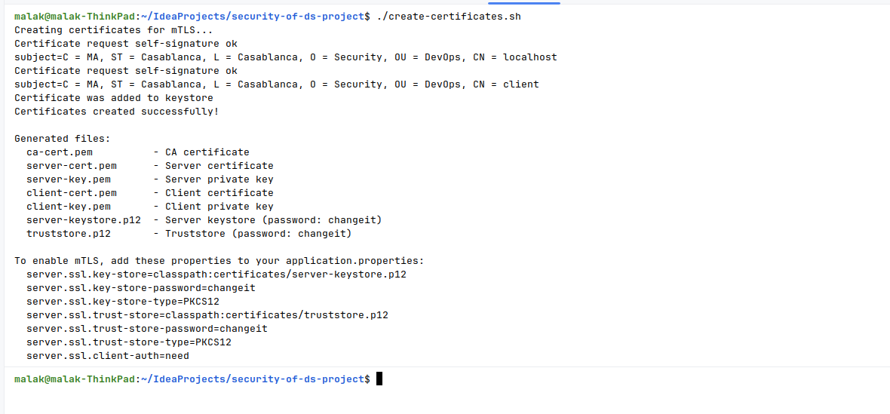

*Figure 18: Processus de génération des certificats SSL pour mTLS*

### 3. Démarrage des Services d'Infrastructure
```bash
# Démarrage des bases de données et Keycloak
docker compose up -d postgres-product postgres-order keycloak
```

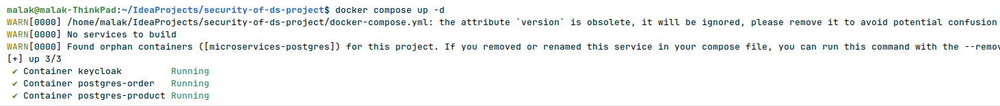

*Figure 19: Démarrage réussi des conteneurs Docker avec bases de données et Keycloak*

### 4. Configuration Keycloak
Keycloak est initialisé automatiquement via le script `keycloak-init.sh`.

Credentials par défaut :
- **Username** : admin
- **Password** : admin
- **Realm** : microservices-realm

### 5. Build de Tous les Services
```bash
# Build de tous les services Spring Boot
mvn clean install -DskipTests
```

### 6. Démarrage des Micro-services
```bash
# Démarrage dans l'ordre : discovery -> gateway -> product/command
java -jar discovery-service/target/discovery-service-*.jar &
java -jar gateway-service/target/gateway-service-*.jar &
java -jar product-service/target/product-service-*.jar &
java -jar command-service/target/command-service-*.jar &
```

### 7. Configuration du Frontend (Optionnel)
```bash
cd frontend
npm install
npm start
```

## Exécution de l'Application

### Mode Développement
Pour le développement local avec sécurité désactivée :

```bash
# Démarrage de l'infrastructure
docker-compose up -d

# Démarrage des services (sécurité désactivée dans application.properties)
mvn spring-boot:run -pl discovery-service &
mvn spring-boot:run -pl gateway-service &
mvn spring-boot:run -pl product-service &
mvn spring-boot:run -pl command-service &
```

### Mode Production
```bash
# Démarrage de tous les services avec sécurité complète
docker-compose up -d
mvn spring-boot:run
```

### Points d'Accès

- **Frontend** : http://localhost:3000
- **API Gateway** : http://localhost:8087
- **Keycloak** : http://localhost:8180
- **Tableau de Bord Discovery** : http://localhost:8761
- **Swagger Produit** : http://localhost:8083/swagger-ui.html
- **Swagger Commande** : http://localhost:8084/swagger-ui.html

## Documentation API

Chaque service expose une documentation OpenAPI/Swagger interactive et complète :

### Service Produit - Documentation Swagger
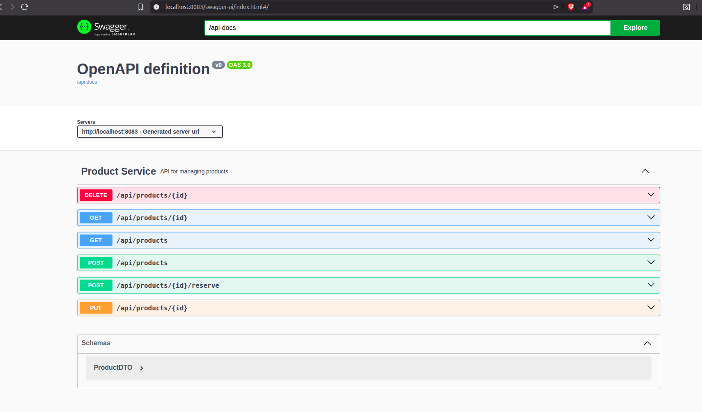

*Figure 13: Documentation Swagger du micro-service Produit avec tous les endpoints CRUD*

Endpoints disponibles :
- `GET /api/products` - Lister tous les produits (ADMIN, CLIENT)
- `GET /api/products/{id}` - Détail d'un produit (ADMIN, CLIENT)
- `POST /api/products` - Créer un produit (ADMIN uniquement)
- `PUT /api/products/{id}` - Modifier un produit (ADMIN uniquement)
- `DELETE /api/products/{id}` - Supprimer un produit (ADMIN uniquement)

### Service Commande - Documentation Swagger
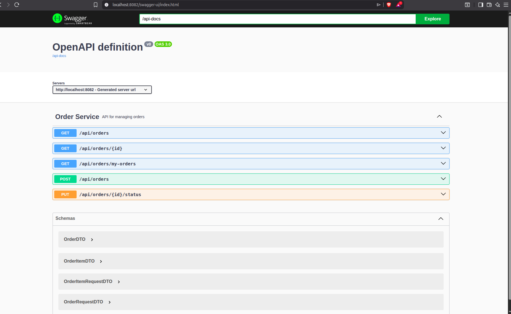

*Figure 14: Documentation Swagger du micro-service Commande avec gestion des commandes*

Endpoints disponibles :
- `GET /api/orders` - Lister ses commandes (CLIENT) / Toutes (ADMIN)
- `GET /api/orders/{id}` - Détail d'une commande (propriétaire ou ADMIN)
- `POST /api/orders` - Créer une nouvelle commande (CLIENT)

### API Gateway

Le Gateway route toutes les requêtes `/api/**` vers les services appropriés avec :
- Validation automatique des tokens JWT
- Routage basé sur les chemins d'URL
- Centralisation des règles de sécurité

### Exemples d'Appels API Sécurisés

```bash
# Récupérer le token JWT depuis Keycloak
TOKEN=$(curl -X POST http://localhost:8180/realms/microservices-realm/protocol/openid-connect/token \
  -H "Content-Type: application/x-www-form-urlencoded" \
  -d "grant_type=password&client_id=microservices-client&username=user&password=password" \
  | jq -r '.access_token')

# Récupérer les produits avec authentification
curl -H "Authorization: Bearer $TOKEN" \
     http://localhost:8087/api/products

# Créer une commande avec authentification
curl -X POST -H "Authorization: Bearer $TOKEN" \
     -H "Content-Type: application/json" \
     -d '{"items":[{"productId":1,"quantity":2}]}' \
     http://localhost:8087/api/orders
```

### Gestion des Erreurs API

- **401 Unauthorized** : Token manquant ou invalide
- **403 Forbidden** : Permissions insuffisantes (rôle incorrect)
- **409 Conflict** : Stock insuffisant pour la commande
- **404 Not Found** : Ressource inexistante
- **400 Bad Request** : Données invalides

## Configuration

### Variables d'Environnement
```bash
# Base de données
POSTGRES_USER=user
POSTGRES_PASSWORD=password

# Keycloak
KEYCLOAK_ADMIN=admin
KEYCLOAK_ADMIN_PASSWORD=admin

# DevSecOps
SONAR_HOST_URL=http://localhost:9000
SONAR_TOKEN=votre_token_sonar
```

### Profils Spring
- **default** : Configuration production
- **test** : Configuration de test (sécurité désactivée)
- **docker** : Configuration environnement Docker

## Pipeline DevSecOps

Exécutez des vérifications complètes de sécurité et qualité :

```bash
# Exécuter le pipeline DevSecOps complet
./devsecops/run-devsecops.sh

# Définir le token SonarQube si nécessaire
export SONAR_TOKEN=votre_token
./devsecops/run-devsecops.sh
```

### Composants du Pipeline

1. **Analyse des Dépendances** : OWASP Dependency-Check pour les bibliothèques vulnérables
2. **Qualité du Code** : Analyse SonarQube pour les code smells et bugs
3. **Tests Unitaires** : Exécution automatisée des tests
4. **Scan des Conteneurs** : Trivy pour la vulnérabilité des images Docker
5. **Rapport de Sécurité** : Évaluation de sécurité consolidée

Les rapports sont générés dans le répertoire `reports/`.

## Directives de Développement

### Style de Code
- Suivre les bonnes pratiques Spring Boot
- Utiliser Lombok pour réduire le code boilerplate
- Implémenter des tests unitaires complets
- Documenter les APIs avec les annotations OpenAPI

### Bonnes Pratiques de Sécurité
- Ne jamais commiter les certificats ou secrets
- Utiliser les variables d'environnement pour les données sensibles
- Implémenter une validation d'entrée appropriée
- Suivre le principe du moindre privilège

### Tests

Le projet maintient une couverture de tests supérieure à 80% avec JaCoCo. Les tests incluent :

- **Tests Unitaires** : Validation des contrôleurs REST, services métier, et repositories avec Mockito pour le mocking des dépendances.
- **Tests d'Intégration** : Validation de la communication inter-services, propagation JWT, et appels API sécurisés.
- **Tests de Sécurité** : Vérification des autorisations par rôle et gestion des erreurs d'authentification.

```bash
# Exécuter tous les tests
mvn test

# Exécuter les tests d'un service spécifique
mvn test -pl product-service

# Générer les rapports de couverture
mvn jacoco:report
```

### Journalisation
Les logs applicatifs sont écrits dans le répertoire `logs/` :
- `product-service.log`
- `command-service.log`
- `gateway-service.log`
- `discovery-service.log`

## Contribution

1. Fork le dépôt
2. Créer une branche de fonctionnalité (`git checkout -b feature/amazing-feature`)
3. Commiter vos changements (`git commit -m 'Add some amazing feature'`)
4. Push vers la branche (`git push origin feature/amazing-feature`)
5. Ouvrir une Pull Request
